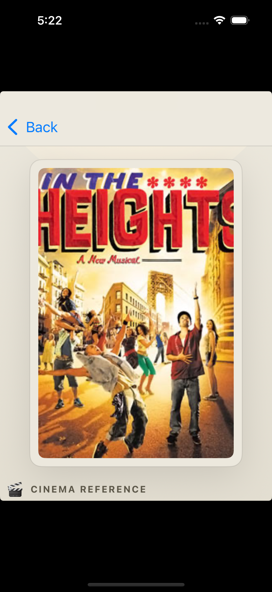

# FilmPost

FilmPost is a lightweight iOS MVP that acts like an AI photography coach. A user picks one **subject** photo and one **background** photo, taps **Analyze**, and receives three cinematic photo directions that help them stage a stronger image *before* the shutter clicks.

It is intentionally **not** a filter app. The product focuses on pose, framing, light, color mood, camera distance, and **director-led cinema references** so the output reads as creative direction, not post-processing advice.

## Screens

| Upload | Analyzing | Director results | Swipeable card | Cinema reference | Director profile |
| --- | --- | --- | --- | --- | --- |
|  |  |  |  |  |  |

## Architecture

```text
FilmPost/
├── backend/                  FastAPI service that talks to OpenAI
│   ├── app/
│   │   ├── main.py           POST /v1/analyze + slowapi rate limiting + health
│   │   ├── services.py       EXIF scrub + Pillow downscale + AsyncOpenAI client (timeout/cap/retry)
│   │   ├── prompts.py        Coaching system prompt + director-reference prompt
│   │   ├── models.py         Pydantic response schema (the contract)
│   │   └── config.py         Env-driven settings (uploads, OpenAI caps, rate limits)
│   └── tests/                Pytest: API + image sanitizer (EXIF/orientation/fallback)
├── ios/
│   ├── FilmPost/
│   │   ├── App/              AppModel (cancellable analyze) + ImageUploadCompressor
│   │   ├── Features/         Upload, Camera, Loading (cancel), Results (carousel + share)
│   │   └── Features/Cinema/  Wikipedia poster + portrait loaders w/ actor cache + attribution
│   ├── FilmPostCore/         Swift package: typed models + multipart client + URLError mapping
│   └── project.yml           XcodeGen spec (no .xcodeproj checked in)
└── docs/screenshots/         Captures used in this README
```

**Data flow:** the app reads two `PhotosPicker` images (or a fresh camera capture) → an upload-side downscale to ≤2048px JPEG q=0.8 trims cellular waste → `FilmPostCore` builds a `multipart/form-data` request with a 45s timeout → `POST /v1/analyze` strips EXIF/GPS, applies orientation, and re-downscales (Pillow, 1568px long edge) before calling `client.responses.parse(text_format=AnalysisResponse)` to enforce a typed JSON contract with director notes + cinema references → app renders three swipeable cards with carousel haptics, a system Share sheet per direction, and tappable Wikipedia attribution under each cinema poster / director portrait.

**Privacy & cost guardrails:** EXIF/GPS metadata is scrubbed server-side before any image bytes leave for OpenAI; the analyze call has a 30s wall-clock cap, a 1200-token output ceiling, one retry on transient timeout, and per-IP rate limiting (10/min · 100/day) via `slowapi`. On the iOS side, in-flight analyze requests are cancellable from the loading screen, and Wikipedia poster/portrait lookups are memoized in a process-wide actor cache so revisiting the same film/director is instant.

## Tech Stack

- **iOS:** SwiftUI, PhotosPicker, `@Observable`, iOS 17+, XcodeGen
- **Backend:** Python 3.11+, FastAPI, Pydantic v2, OpenAI Python SDK, Pillow
- **AI:** OpenAI vision-capable model (`gpt-4o-mini` by default) with structured-output parsing — the Pydantic model *is* the response schema

## Quick Start (mentor path)

### Prerequisites

- macOS with **Xcode 16+** (full Xcode, not just Command Line Tools)
- **Python 3.11+**
- **XcodeGen** — `brew install xcodegen`
- An **OpenAI API key** with access to a vision-capable model

### 1. Clone

```bash
git clone https://github.com/easyrider11/FilmPost.git
cd FilmPost
```

### 2. Run the backend

```bash
cd backend
python3 -m venv .venv
source .venv/bin/activate
pip install -r requirements-dev.txt
cp .env.example .env
# open .env and paste your OPENAI_API_KEY
uvicorn app.main:app --reload
```

API serves at `http://127.0.0.1:8000`. Health check: `curl http://127.0.0.1:8000/health`.

### 3. Run the iOS app

In another terminal:

```bash
cd ios
xcodegen generate
open FilmPost.xcodeproj
```

In Xcode: pick **iPhone 16** (or any iOS 17+ simulator), press **⌘R**.

### Backend environment variables

| Variable | Purpose | Default |
| --- | --- | --- |
| `OPENAI_API_KEY` | Required for live analysis. Without it `/v1/analyze` returns 503. | *(unset)* |
| `OPENAI_MODEL` | Vision model used for parsing | `gpt-4o-mini` |
| `FILMPOST_MAX_UPLOAD_BYTES` | Upload cap per image | `8388608` (8 MB) |
| `FILMPOST_CORS_ORIGINS` | JSON list of allowed origins | loopback only |
| `FILMPOST_ANALYSIS_TIMEOUT_SECONDS` | Wall-clock cap on the OpenAI call | `30.0` |
| `FILMPOST_ANALYSIS_MAX_OUTPUT_TOKENS` | Per-call token ceiling (cost guard) | `1200` |
| `FILMPOST_RATE_LIMIT_PER_MINUTE` | Per-IP burst cap on `/v1/analyze` | `10/minute` |
| `FILMPOST_RATE_LIMIT_PER_DAY` | Per-IP daily cap on `/v1/analyze` | `100/day` |
| `FILMPOST_RATE_LIMIT_ENABLED` | Set `false` in tests / behind your own gateway | `true` |

### Tests

```bash
# Backend (FastAPI + image sanitizer + service)
cd backend && source .venv/bin/activate && pytest -q

# iOS core (multipart, decoding, share text, URLProtocol-stubbed APIClient)
cd ios/FilmPostCore && swift test
```

Both suites run with stubs — no OpenAI key or live network required. The iOS APIClient tests use a `URLProtocol` stub to drive the real `URLSession` + multipart + decoder seam against scripted responses (happy path, 4xx with backend `detail`, offline, timed-out, garbage body).

## Running on a Physical Device or TestFlight

The default backend URL in [ios/FilmPost/Info.plist](ios/FilmPost/Info.plist) is `http://127.0.0.1:8000`, which only resolves on the simulator. For a real device or TestFlight build you must:

1. **Set a signing team.** Open [ios/project.yml](ios/project.yml) and fill in `DEVELOPMENT_TEAM` with your Apple Developer team ID, then re-run `xcodegen generate`.
2. **Point the app at a reachable backend.** Either:
   - **LAN dev:** replace `FilmPostAPIBaseURL` with `http://<your-mac-LAN-ip>:8000` and add an ATS exception, or
   - **TestFlight-grade:** deploy `backend/` behind HTTPS (Fly.io, Render, Cloud Run, etc.) and use that URL.
3. **Archive & upload.** Xcode → *Product → Archive*, then *Distribute App → App Store Connect → Upload*.
4. **Add internal testers** in App Store Connect → TestFlight.

## Design Notes

- The Pydantic `AnalysisResponse` model in [backend/app/models.py](backend/app/models.py) doubles as the contract sent to OpenAI via `responses.parse(text_format=...)` — there is no separate JSON-schema file to keep in sync.
- The system prompt in [backend/app/prompts.py](backend/app/prompts.py) now enforces *contrast across three directions* plus a **cinema-reference layer**: each recommendation must tie the location to a recognizable film scene or director signature and explain what to borrow from it.
- Each result card now has three reading layers: a **director note**, a **cinema anchor** (film + director + scene takeaway), and the tactical on-set details (pose, composition, color, distance, light).
- Sample images live in [ios/FilmPost/Resources/DebugSamples](ios/FilmPost/Resources/DebugSamples) — launch with the `-auto-demo` argument to skip the picker for quick demos.

## Verified

- `pytest -q` → **17 passed** (image sanitizer + service guards + API contract)
- `swift test` in `ios/FilmPostCore` → **8 passed** (multipart, decoding, share text, URLProtocol-stubbed APIClient)
- `xcodegen generate && xcodebuild -scheme FilmPost ... build` → clean build on iPhone 16 simulator (iOS 18)
- End-to-end run on iPhone 16 simulator hitting a local backend with a real OpenAI key — the refreshed screenshots above were captured from the current live build.

## Known Limitations

- No persistence, history, or saved shoots.
- No on-device composition overlays (only the captured / picked photo is analyzed; FilmPost does not draw on top of a live viewfinder).
- No authentication, analytics, or moderation layer.
- Backend base URL is configured at build time, not in-app.
- The MVP returns **textual film references** plus Wikipedia-sourced posters / portraits with on-screen attribution — not licensed still-image assets — to keep the feature demoable without adding paid third-party asset dependencies.
- Per-IP rate limiting uses in-process state (slowapi default); for multi-instance deployment, point it at a shared Redis backend.
- Placeholder app icon — fine for review, not branding.

## License

MIT — see [LICENSE](LICENSE) if added, otherwise treat as MIT for evaluation purposes.
